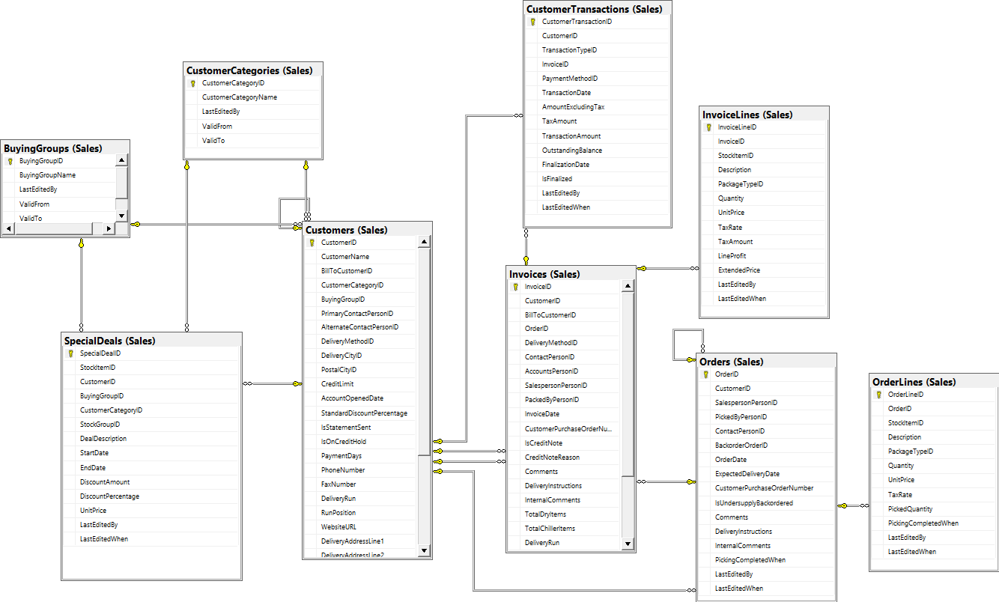
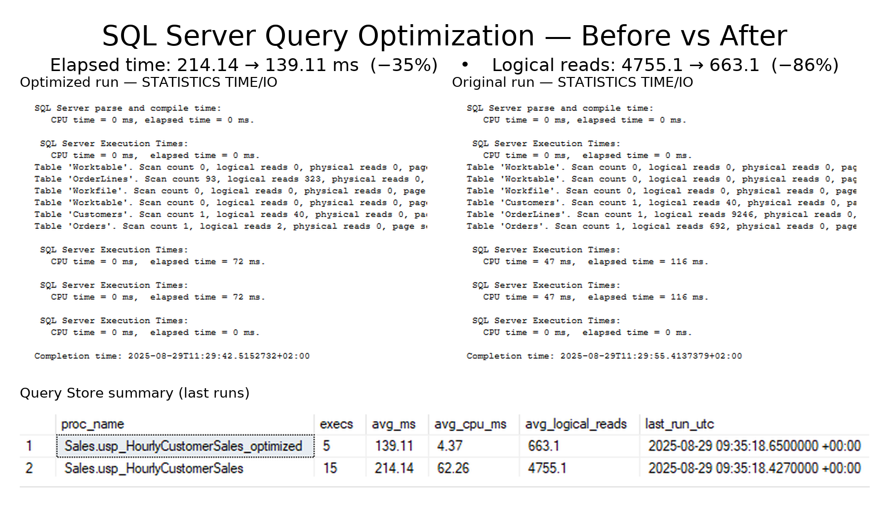

# MSSQL Project – WideWorldsImporter Sales Analysis


## Table of Contents

1. [Project Overview](#project-overview)

2. [Dataset Presentation](#dataset-presentation)

3. [Sales Analysis](#sales-analysis)

4. [Entity Relationship Diagram (ERD)](#erd--entity-relationship-diagram)

5. [Stored Procedures](#️stored-procedures)

6. [SQL Optimization](#sql-optimization)

7. [Power BI Report](#power-bi-report)

8. [Key Learnings](#key-learnings)


---


## Project Overview

This project is based on the **WideWorldsImporter dataset**, a sample database provided by Microsoft that simulates an international wholesale company.

The dataset contains information about customers, suppliers, sales, purchases, stock levels, and employee details, which makes it ideal for practicing **data analysis and optimization techniques**.


The focus of this project is on **Sales Analysis**, using T-SQL, stored procedures, optimization strategies, and visualization with Power BI.


---


## Dataset Presentation

The **WideWorldsImporter** dataset includes:

- Customers and suppliers

- Sales orders and invoices

- Stock and product information

- Employees and purchasing details


This rich dataset provides a realistic environment to explore **business intelligence and reporting**.


---


## Sales Analysis

The analysis focuses on:

- Total sales per region and customer category

- Monthly and yearly revenue trends

- Best-selling products and suppliers

- Employee sales performance


---


## ERD – Entity Relationship Diagram

The following ERD shows the main relationships between tables in the WideWorldsImporter database:





---


## Stored Procedures

A set of **stored procedures** were created to:

- Automate repetitive queries

- Generate sales reports (e.g., monthly/yearly revenue, top products)

- Simplify data retrieval for Power BI

- Improve maintainability and modularity of the SQL code


---


## SQL Optimization

### Initial Query
**File:** [`sql/optimization/query_to_optimize.sql`](sql/optimization/query_to_optimize.sql)  

- Computes revenue inline with `SUM(Quantity * UnitPrice)`  
- Uses forced index hints (`WITH (INDEX(0))`) which prevent the optimizer from using better indexes  
- Results in full table scans and heavy CPU usage

### Optimized Query
**File:** [`sql/optimization/query_optimized.sql`](sql/optimization/query_optimized.sql)  

- Adds a **persisted computed column** `LineAmount = Quantity * UnitPrice`  
- Pre-aggregates totals per `OrderID` in a CTE before joining → reduces row volume  
- Removes forced index hints, allowing the optimizer to use the best indexes  

### Indexing Strategy
**File:** [`sql/optimization/optimization.sql`](sql/optimization/optimization.sql)  

- **Orders Table**
  ```sql
  CREATE NONCLUSTERED INDEX IX_Orders_OrderDate_CustomerID
  ON Sales.Orders (OrderDate, CustomerID)
  INCLUDE (OrderID);
- Supports **range filters** on `OrderDate` (`@StartTime`, `@EndTime`)  
- Groups efficiently by `CustomerID`  
- Covers joins via included `OrderID`  

- **OrderLines Table**
  ```sql
  CREATE NONCLUSTERED INDEX IX_OrderLines_OrderID_LineAmount
  ON Sales.OrderLines (OrderID)
  INCLUDE (LineAmount);
- Optimizes the join on `OrderID`  
- Covers the pre-aggregation `SUM(LineAmount)`  

---

### Measuring the Improvement
**File:** [`sql/optimization/getPerformanceDiff.sql`](sql/optimization/getPerformanceDiff.sql)  

Leverages **Query Store** to compare the original and optimized procedures:
- Execution count  
- Average duration (ms)  
- CPU time (ms)  
- Logical reads  
- Last execution timestamp  

---

### Results
By aligning indexes with filtering, grouping, and joining patterns:
- **I/O reduced** → fewer page reads due to selective seeks  
- **CPU reduced** → persisted computed column avoids per-row multiplication  
- **Less memory pressure** → early aggregation reduces rowset size  
- **Execution time** improves significantly  




## Power BI Report

The final analysis is presented in an interactive **Power BI dashboard**, showcasing KPIs, charts, and trends for better decision-making.


---


## Key Learnings

- Designing and documenting a database with an ERD

- Creating and optimizing stored procedures

- Understanding query performance and SQL optimization

- Building a full reporting pipeline from SQL to Power BI

